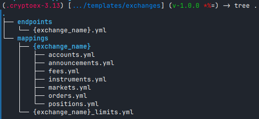
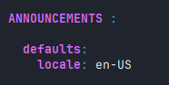
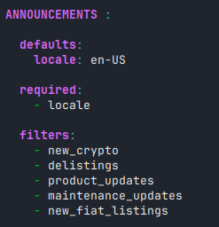
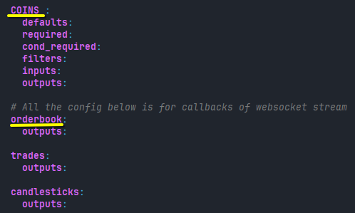
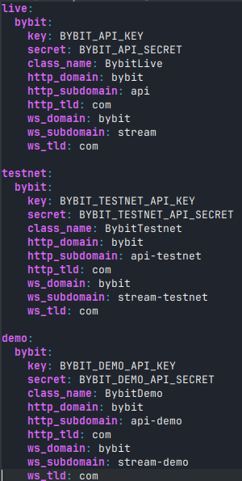

# cryptoex

REST and Websockets connecter for crypto exchanges.
## How to work on a new exchange?
Let's say we want to create a new exchange: Binance. 
First do:
```console
git clone https://github.com/ayyoub-bms/cryptoex.git
```

This will set you for the `main` branch. Create your own branch:
```console
git checkout -b binance_setup
```

Then work on it and commit your changes and push to the remote:
```console
git add {stuff to add}
git commit -m "ADD: Binance setup"
git push origin binance_setup
```

Next, create a pull request and link it with the branch you just pushed. I will then be responsible of merging with the master branch. If something is missing /incorrect I will leave you a comment there.


## How to add configuration files of an exchange ?
To add a new exchange you need to follow the following steps:

1. Copy the template tree structure from `templates/exchanges` to `config/exchanges` and change the placeholder `{exchange_name}` by the name of your exchange. then fill in the endpoints and mappings accordingly. You might want to check for example bybit's config. 

	
	
	<span style="color:blue;">**couple of notes:**</span> 
	
	- Each endpoint have the following tags:
		+ `required`: Represents the fields that are required for a given request.
		+ `cond_required`: Represents the fields that are required given we select a filed requiring it. Example: if we attach a `stop_loss` to an order then the `stop_price` becomes required!
		+ `defaults`: the default keyword arguments that we want to set to a given request. For example the announcements have a required argument `locale`. We want to set it always to english hence:

			
		
		+ `filters`: Represents a list of fields that we want to filter out from our output automatically for all requests. _See for example the announcements in bybit_

			
		
		+ `inputs`: Represent the mapping `local to exchange`. If the exchage expects `orderType` then in the input we should have the mapping: 
		>`order_type: orderType`
		+ `outputs`: Represent the mapping `exchange to local`. If the exchage sends us `initialMargin` then in the input we should for ex. have the mapping: 
		>`initialMargin: initial_margin`
		
	- 	Lower case (2nd level keys only) are meant for callbacks of websocket streams and have outputs only, whilst uppercase ones are meant for REST.

		
2. Add The general config of the exchange in the file `config/exchanges/exchanges.yml`. here you need to setup the details of each universe if necessary: live, testnet and demo (aka. paper accounts). Note that the keys and secrets will be read from environement variables hence keep them as placeholders (replace bybit by your exchange name)
	
	
	
3. If the package is used as is without install, the `config` dir containing the logging and exchanges needs to be copied to `~/.config/cryptoex` for `unix` like systems.

## What to do after the configuration files are set?

1. Create the exchange python file in `cryptoex/exchanges` and edit its content. Implement the http methods and websockets ones as well as the helper methods.
2. Add the exchange class in `cryptoex/exchanges/__init__.py`
3. Create a formatter file for the exchange. [Optional if not using the monitor app]

## How to install the library?

```console
# cd to where setup.py is located. ie: /path/to/cryptoex then run
pip install . --use-pep517
```
